# 🔑 Protocol Module — Mini TLS-like Secure Channel (C++)

>This module demonstrates a modern secure channel in C++: ephemeral key exchange, session key derivation, and encrypted record exchange. It is designed for clarity, security, and teaching.

---

## 📈 Protocol Flow


---

## 🧩 Components

- **Key Exchange:** X25519/ECDH for forward secrecy (ephemeral keys).
- **Key Derivation:** HKDF-SHA256 → `session_key_enc` (AES-GCM), `session_key_mac` (optional).
- **Record Protocol:**
	- Format: `[Length (2B)] [Nonce (12B)] [Ciphertext]`
- **Rekeying:** New ECDH after N messages or T seconds.

---

## 🔒 Security Properties

- **Confidentiality:** AES-GCM encryption
- **Integrity:** GCM authentication tag
- **Forward Secrecy:** Ephemeral ECDH keys
- **Replay Protection:** Nonce + transcript binding

---

## 🛠️ C++ API Example

```cpp
// Handshake
ProtocolContext ctx;
ctx.handshake(peer_pubkey);

// Encrypt
std::vector<uint8_t> ciphertext = ctx.encrypt(plaintext);

// Decrypt
std::vector<uint8_t> plaintext = ctx.decrypt(ciphertext);
```

---

## 🧪 Testing Strategy

- **Positive:** Successful handshake & message exchange
- **Negative:** Tampered ciphertext → decryption failure
- **Replay:** Reusing nonce → rejection
- **Rekey:** Session rollover after threshold

---

## 🎯 Why It Matters

- Demonstrates cryptographic engineering (ECDH, HKDF, AES-GCM)
- Shows system glue (handshake, record protocol, rekey)
- TLS intuition without OpenSSL boilerplate
- Teaching demo & recruiter-facing project

---

## 🔄 Sequence Diagrams

### 🟢 Initial Handshake


### 🔄 Rekey Event

```mermaid
sequenceDiagram
		participant Client
		participant Server
		Client->>Client: Generate New Ephemeral Key
		Client->>Server: Rekey_Request + PublicKey_C'
		Server->>Server: Generate New Ephemeral Key
		Server->>Client: Rekey_Response + PublicKey_S'
		Client->>Client: ECDH(C'_priv, S'_pub)
		Server->>Server: ECDH(S'_priv, C'_pub)
		Note over Client,Server: HKDF → New SessionKey
		Note over Client,Server: Switch to new AES-GCM keys
		Client-->>Server: Continue Secure Messages
		Server-->>Client: Continue Secure Messages
```



---

## 📝 Implementation Notes

- **Transcript Hashing:** Each handshake/rekey includes a hash of prior messages.
- **Replay Protection:** Nonce values incremented per record; old nonces rejected.
- **Rekey Policy:**
	- After `N` messages (e.g., 1,000)
	- After `T` seconds (e.g., 5 min)
- **Fallback:** If rekey fails, session terminates.

---

---

## 📂 Components  

- **Key Exchange:**  
	- X25519 / ECDH for forward secrecy.  
	- Each side generates ephemeral keys.  

- **Key Derivation:**  
	- HKDF-SHA256 expands the shared secret into:  
		- `session_key_enc` (AES-GCM key)  
		- `session_key_mac` (if separate integrity needed).  

- **Record Protocol:**  
	- Messages framed as records:  

+----------------+----------------+------------------+
| Length (2B) | Nonce (12B) | Ciphertext |
+----------------+----------------+------------------+

- **Rekeying Logic:**  
	- New ECDH after N messages or every T seconds.  
	- Prevents long-term key compromise.  

---

## 🔒 Security Properties  

- **Confidentiality:** AES-GCM ensures strong encryption.  
- **Integrity:** GCM authentication tag prevents tampering.  
- **Forward Secrecy:** Ephemeral ECDH keys protect past sessions.  
- **Replay Protection:** Nonce + transcript binding ensures uniqueness.  

---

## 🛠️ APIs (C++)  

```cpp
// Handshake
ProtocolContext ctx;
ctx.handshake(peer_pubkey);

// Encrypt
std::vector<uint8_t> ciphertext = ctx.encrypt(plaintext);

// Decrypt
std::vector<uint8_t> plaintext = ctx.decrypt(ciphertext);
```

🧪 Testing Strategy
Positive Flow: Successful handshake + message exchange.

Negative Flow: Tampered ciphertext → decryption failure.

Replay Test: Reusing nonce → rejection.

Rekey Test: Session rollover works after threshold.

🎯 Why It Matters
This protocol showcases:

Cryptographic engineering skills (ECDH, HKDF, AES-GCM).

System glue (handshake + record protocol + rekey).

TLS intuition without the boilerplate of OpenSSL.

It serves as a teaching demo and a recruiter-facing project that proves comfort with protocol design + C++ crypto APIs.

---

This gives you a **clean high-level protocol architecture doc** to complement the repo’s main README.  

👉 Do you want me to also sketch a **sequence diagram** (text-based) showing step-by-step handshake + rekey event, so recruiters see the flow at a glance?

# 🔑 Protocol Handshake & Rekey — Sequence Diagram  

---

## 📝 Notes  

- **Transcript Hashing:** Each handshake/rekey includes a hash of prior messages to prevent tampering.  
- **Replay Protection:** Nonce values incremented per record. Old nonces rejected.  
- **Rekey Policy:**  
	- Triggered after `N` messages (e.g., 1,000) OR  
	- Triggered after `T` seconds (e.g., 5 min).  
- **Fallback:** If rekey fails → session terminated.  

---
